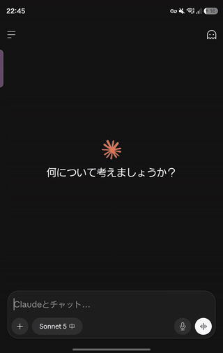

# TempoPad

A small Android app that is one text area and nothing else.

Launching it puts the pad on screen straight away. Whatever is typed stays there, and is still there the next
time the app is opened.

The UI is lifted almost as-is from the editing panel of
[PixelLike CopyMenu](https://github.com/aiya000/Android-PixelLike-CopyMenu), minus the check and close
buttons. TempoPad never reads the clipboard and never copies anything back -- it is just the pad.

## Demo

Opening the pad over another app, typing into it, closing it with a tap on the border, and finding the note
still there the next time.



<sub>[video](docs/demo.mp4)</sub>

## The name

*TempoPad* is **Tempo**rary Memo**Pad** shortened, and at the same time the Japanese テンポ (*tempo*) of
テンポよくメモを取る -- jotting something down at the tempo of the thought that asked for it, without the app
getting in the way.

## Features

- The pad opens with the text of the last session already in it
- The text is written out when the app is left, so nothing has to be saved by hand
- The keyboard is not raised on launch, so the whole note can be read first. Tap the pad to start typing
- The panel keeps its size whether the keyboard is shown or not. The text area is padded at the bottom by the
  height the keyboard hides, so the last line can still be brought above the keyboard
- Tapping outside of the panel exits the app, the same as the back gesture. The outer half of the
  gradient border counts as outside as well, so a thumb aimed at the edge still closes the app when it
  lands a little short
- The window is translucent, so whatever was behind the app stays visible around the panel
- The app stays out of the recent apps list, so it does not sit between you and the app you came from.
  `MainActivity` declares `android:excludeFromRecents="true"`

## Layout

- Language: Kotlin
- UI: Jetpack Compose
- applicationId: `io.github.aiya000.tempopad` (`.debug` is appended to the debug build)
- minSdk 26 / targetSdk 35 / compileSdk 35

```
app/src/main/kotlin/io/github/aiya000/tempopad/
├── MainActivity.kt     -- reads the note, hosts the screen, writes the note back
├── TempoPadScreen.kt   -- the panel and its text area
├── Note.kt             -- where the note is kept
└── Theme.kt            -- colors
```

The note is a single string in a `SharedPreferences` file of its own, `tempo_pad`. It is read in `onCreate`
and written in `onPause`, which covers leaving for another app, the back gesture, and the tap outside of the
panel alike.

## Building

Android Studio is not needed. An Android SDK (platform 35, build-tools) and JDK 17 are enough.

Point `local.properties` at the SDK.

```properties
sdk.dir=/path/to/Android/Sdk
```

With JDK 17 on `PATH`:

```console
$ ./gradlew :app:assembleDebug
```

This produces `app/build/outputs/apk/debug/app-debug.apk`.

When the JDK is managed by mise:

```console
$ mise exec java@17 -- ./gradlew :app:assembleDebug
```

## Installing

```console
$ adb install -r app/build/outputs/apk/debug/app-debug.apk
```

The debug build uses its own application id, so it installs next to the release build. It is the one with the
orange launcher icon, labelled `TempoPad debug`.

The release build is signed with a personal key whose location and passwords are read from
`~/.gradle/gradle.properties`, so this repository carries no secret. Where those properties are absent the
build still runs and produces an unsigned APK.

## License

[MIT License](LICENSE)
